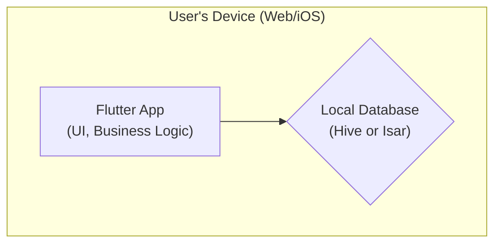
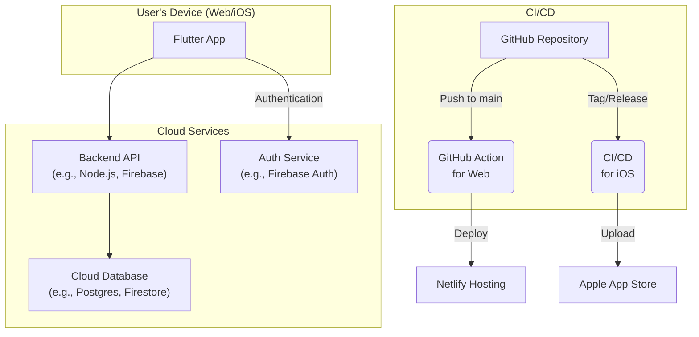

# Architecture & Tech Stack

This document outlines the architecture and technology stack for the MyAccounting application.

## 1. Frontend

*   **Framework:** Flutter
*   **Platforms:** Web and iOS
*   **Reasoning:** Flutter allows for a single codebase to build high-performance applications for multiple platforms, including iOS, Android, web, and desktop. This is ideal for the goal of targeting web and iOS initially.

## 2. Backend

*   **Initial Approach:** None (Local-first)
*   **Data Storage:** All data will be stored locally on the user's device.
*   **Future Plans:** The architecture will be designed to accommodate a future backend. When needed, we can introduce a backend service (e.g., Node.js with Express, or a serverless solution like Firebase Functions) to enable data synchronization across devices and other cloud features.

## 3. Database

*   **Type:** Local Database
*   **Recommendation:** [Hive](https://pub.dev/packages/hive) or [Isar](https://pub.dev/packages/isar).
*   **Reasoning:** Both are fast, lightweight, and cross-platform (work on mobile and web). They are more powerful than simple key-value stores like `shared_preferences` and are suitable for storing structured data for an accounting app.

## 4. State Management

*   **Recommendation:** [Riverpod](https://riverpod.dev/)
*   **Reasoning:** Riverpod is a modern, flexible, and robust state management library for Flutter. It helps in managing application state in a clean and testable way, which is crucial as the application grows in complexity.

## 5. Styling

*   **Approach:** Flutter's built-in widget library.
*   **Details:** Flutter uses a declarative UI, where styling is defined directly in the widget code (e.g., using `TextStyle`, `Container` decorations, etc.). We will use Material Design as a base and customize it to fit the app's branding. No external CSS frameworks are needed.

## 6. Auth

*   **Initial Approach:** Not needed.
*   **Future Plans:** When a backend is introduced, authentication will be necessary. We could use:
    *   **Firebase Authentication:** Provides a ready-to-use, secure authentication system.
    *   **Custom JWT-based Auth:** For more control over the authentication logic.

## 7. Hosting & Deployment

*   **Web:**
    *   **Platform:** Netlify
    *   **Process:** A GitHub Action will be set up to automatically build the Flutter web application and deploy it to Netlify on every push to the `main` branch.
*   **iOS:**
    *   **Process:** This will be a manual or semi-automated process involving building the app archive in Xcode and uploading it to App Store Connect. An Apple Developer Program membership is required.

## 8. Architecture Diagram

Here is a simple diagram illustrating the proposed architecture.

### Initial (Local-First) Architecture

### Future Architecture (with Backend)

